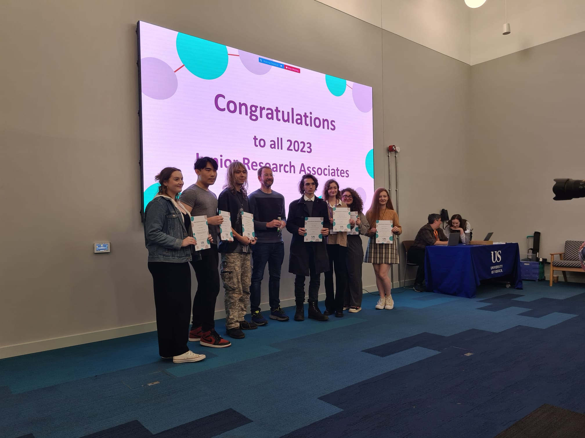

---
authors:
- jingxiong-xu
categories:
- Reality Bending Lab
- University of Sussex
date: "2023-11-02"
title: "Junior Research Assistant (JRA) at Sussex: is it worth it?"
draft: true
featured: false
image:
  caption: ''
  placement: 0
subtitle: ""
summary: "I worked as a Psychology JRA during summer 2023 at the Reality Bending Lab. Here is how it went."
tags:
- Reality Bending Lab
- ReBeL
- University of Sussex
- Psychology
- Neuropsychology
- Physiological
- Psychophysiology
- JRA
- Junior Research Assistant
- Scheme
- Internship
- Summer
---

Hi all, I am [Jing](https://realitybending.github.io/authors/jingxiong-xu/), and I thought I would share my experience as a Psychology Junior Research Assistant (JRA) at the University of Sussex, as many students might wonder how it is really like. Obviously, I cannot speak for all the labs, but I hope my experience can give you a general idea of what to expect.

I worked as a JRA during summer 2023 at the Reality Bending Lab (ReBeL). And to put it simply, I think it was **the most valuable experience** during my undergraduate journey *(PS: I have **not** written this at gunpoint)*. During these three months, I was supervised by Dr Makowski to work on a piece of original research, that thought me a lot about programming, cognitive neuropsychology, physio recordings and how real research is done. Additionally, know that it is possible to stay in the same lab next academic year, to do your final year **dissertation with a strong head start** in terms of skills and knowledge. 

 

I had the pleasure of joining the Reality Bending Lab (ReBeL) along with [Auz](https://realitybending.github.io/authors/auz-moore/), as the first two members since the lab moved to the UK. The title of my project was **"Exploring the Correlation between Interoception and Primal World Beliefs"**, which involved collecting **physiological data** (e.g., heart rate, respiration, ...) in various tasks, analysing them, and investigating the relationship between various measures. The project started from scratch, where I learned how to use the **JavaScript package JsPsych** to build the entire paradigm via coding. I also received detailed training on how to run a lab-based experiment, something I used to be worried but am now **extremely confident about**. After collecting the data from 20 participants (*summer time goes by veryyyy fast!*), I learned how to make and visualize Bayesian correlations in R. The output of this project was made into an academic poster, where I had to be creative and selective, to be presented at the poster session (see below). Additionally, we created the [*"Sussex Psychophysiological Research Protocol"*](https://github.com/RealityBending/SussexPhysioProtocol), a document aiming at providing guidelines for the best practices in psychophysiological research, to benefit future research done at Sussex. It might not seem like much, but it felt like doing real contributions to research, which was great!

Something important I learned is, beyond pure academic excellence, research is also about community and networking. It was a great occasion to **informally meet many researchers**, and make bonds with other students. What is cool is that the JRA journey doesn't stop abruptly and continues into the next academic year, as all candidates are invited to present their work at the **JRA conference** held by the university in October. This was an amazing opportunity to get a glimpse of what a scientific conference might be, feel proud about your work, connecting with fellow students, learning how to talk about research with other staff members, and gaining public speaking skills. For those who are more ambitious, why not submit your work to the national level, and present it in the British Conference for Undergraduate Research (BCUR)? 

In summary, I see the JRA as a golden key to open countless possibilities for your **future career path**. For those considering applying to **postgraduate studies** or research assistants, the strong research experience you gained will **put you at the top of the list**. Even for those who decided to not do research in the future, it will still be rewarding as it gives a clear idea of what career you do not want. Don't miss on it!

- Jing

