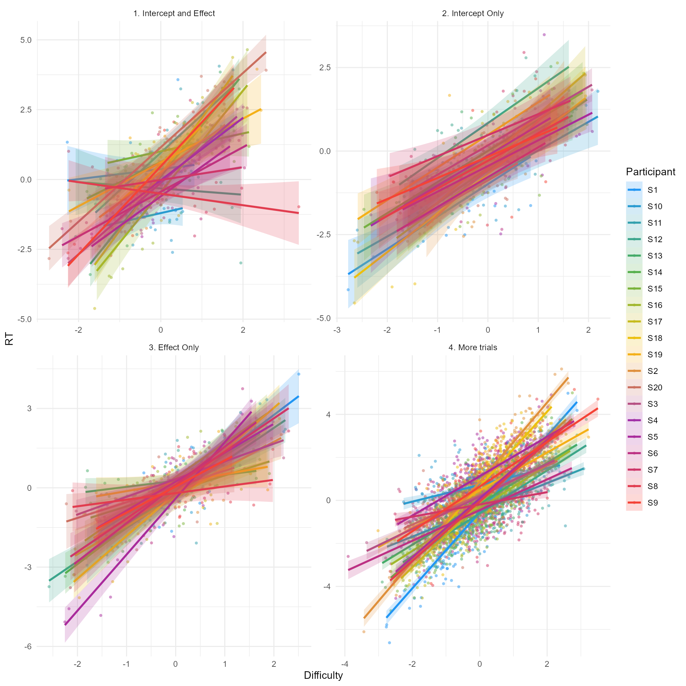
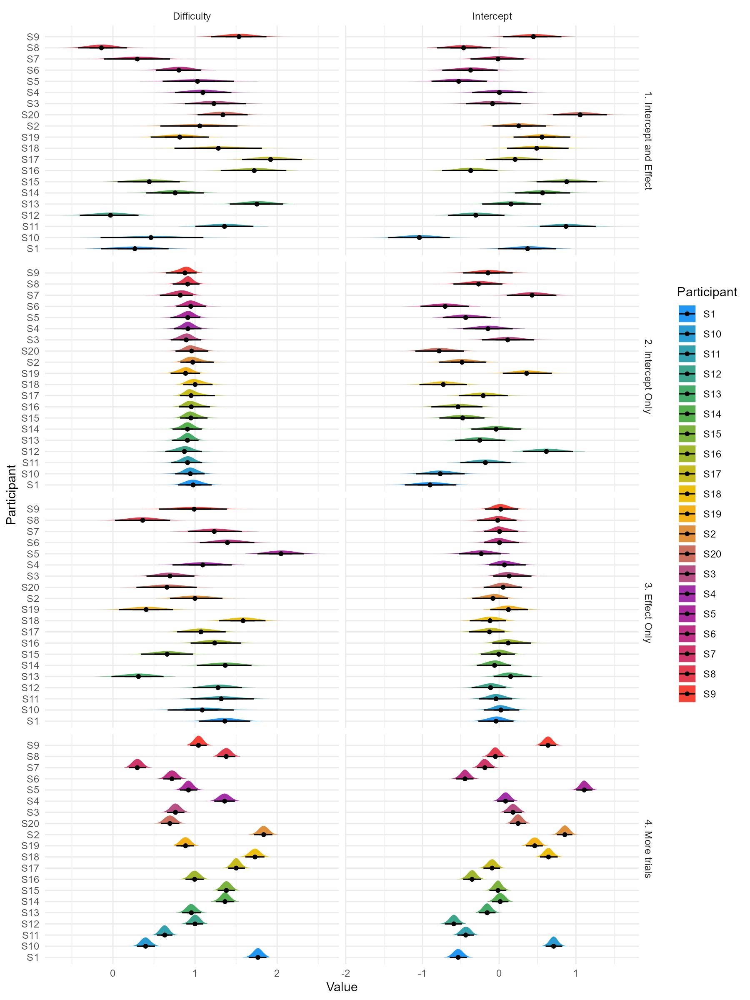

---
authors:
- Dominique Makowski
categories:
- R
- Statistics
date: "2024-03-18"
draft: false
featured: false
title: "How to Assess Task Reliability using Bayesian Mixed Models"
subtitle: ""
summary: "Task reliability in assessing inter-individual differences is a key issue for differential psychology and neuropsychology."
tags:
- Reality Bending Lab
- ReBeL
- Psychology
- Neuropsychology
- Statistics
- R
- Mixed Models
- Bayesian
---

Using reliable tasks when assessing inter-individual differences is a key issue for differential psychology and neuropsychology, and many research areas are clouded with mixed evidence stemming out of the suboptimal computation of individual scores (e.g., tasks with not enough trials, scores consisting in computing the difference, aka the **contrast** between two conditions; see [Rouder et al., 2024](https://osf.io/preprints/psyarxiv/8ktn6)). As such, measuring and reporting the reliability of the paradigms used could be an important step for **increasing results replicability**. 

Recently, a new approach has emerged, suggesting to assess task sensitivity to inter-individual differences by leveraging mixed models ([Rouder et al., 2024](https://doi.org/10.1177/09637214231220923)). 
In essence, the idea is to fit a statistical model that tests for the **general population level** effect of a manipulation in a given task/experiment (e.g., the impact of a variable **Difficulty** on another variable **RT**), and incorporates a **random effect** for each participant. This "full" mixed model essentially models the general population level by taking into account all the inter-individual effects and - as a side effect - **estimates the effects of interest for each participant separately**.

When fitting these models under a Bayesian framework, one can easily estimate the "variability" (or certainty) of the effect in each participant. This is great, because it allows us to assess a "signal-to-noise" ratio, an index of how much the interindividual variability (how participants vary) is larger than the intraindividual variability (e.g., how much participants vary across trial, or how precisely participants' effects are estimated).

In this "Signal-To-Noise Ratio as Effect Reliability" framework, an ideal task/manipulation would have a strong inter-individual variability (i.e., participants would on average vary a lot) and a low intra-individual variability (each participant would have very consistent effects), which leads to a reliable measure of interindividual effects. 

Let's see how we can do that in R using the `brms` package for fitting Bayesian mixed model. First, let's start to generate 4 datasets with different levels of inter-individual and intra-individual variability.

<details>
  <summary>Show code</summary>
  

```r
library(easystats)
library(tidyverse)
library(brms)
library(patchwork)

# Make function to generate data
generate_data <- function(n_trials=25, effect_sd = 0.4, intercept_sd=0.4, noise=0.8, name="df") {
  df <- data.frame()
  for(participant in 1:20) {
    x <- rnorm(n_trials, 0, 1)
    y <- (1 + rnorm(1, 0, effect_sd)) * x + rnorm(1, 0, intercept_sd)
    y <- y + rnorm(n_trials, 0, noise)
    df <- rbind(df, data.frame(Difficulty=x, RT=y,
                               Participant=paste0("S", participant)))
  }
  df$Name <- name
  df
}

# Generate 4 datasets
df1 <- generate_data(n_trials=20, effect_sd = 0.5, intercept_sd=0.5, name="1. Intercept and Effect")
df2 <- generate_data(n_trials=20, effect_sd = 0.1, intercept_sd=0.5, name="2. Intercept Only")
df3 <- generate_data(n_trials=20, effect_sd = 0.5, intercept_sd=0.1, name="3. Effect Only")
df4 <- generate_data(n_trials=200, effect_sd = 0.5, intercept_sd=0.5, name="4. More trials")

# Plot data
rbind(df1, df2, df3, df4) |>
  ggplot(aes(x=Difficulty, y=RT, color=Participant, fill=Participant)) +
  geom_point2(alpha=0.5) +
  geom_smooth(method="lm", se=TRUE, alpha=0.2) +
  theme_minimal() +
  scale_fill_material_d() +
  scale_color_material_d() +
  facet_wrap(~Name, scales="free")
```

</details>



In each of the dataset, we simulated the data of **20 participants** undergoing a task with *n* trials varying in **difficulty**, and we recorded their **reaction time (RT)**. Note that while in our example *difficulty* is a continuous variable, it would work the same if it was categorical variable (e.g., effect of condition B over A, intervention vs. baseline, incongruent vs. congruent, etc.).

When we fit a linear regression of the form *RT ~ difficulty*, we are estimating two parameters; the *intercept* (which can be seen as the "baseline" RT, i.e., **participants' baseline processing speed** when the difficulty is 0) and the *slope* (how much participants are impacted by this variable). These two parameters are in principle independent (a participant can be very fast regardless of the difficulty, and another one could be equally fast at baseline - same intercept - but very slow when the task is difficult - strong slope). 

We simulated 4 datasets with different participant characteristics:

- **Dataset 1**: Both the RT intercept (**the "baseline" RT**) and the effect of the manipulation (the **effect of difficulty**) vary across participants.
- **Dataset 2**: Not much interindividual variability in the effect (only the baseline RT varies).
- **Dataset 3**: Not much interindividual variability in the baseline RT (only the effect of difficulty varies from participant to participant).
- **Dataset 4**: Same as dataset 1, but with more trials (200 instead of 20). As you can see, the "precision" ribbon around the regression line is much narrower, indicating that the effect is more precisely estimated.

We expect that reliability of the paradigm to measure 1) the sensitivity to **difficulty** and 2) the **baseline RT** will be higher in dataset 4 (because more trials) than in dataset 1. Moreover, the sensitivity to **difficulty** will be particularly low in dataset 2 (where only the baseline RT is set to varies), and similarly for baseline RT in dataset 3 *mutatis mutandis*.

Now, let's fit a Bayesian linear mixed model to each of these datasets (note that we specify the effect of Difficulty as a random *slope* in addition to estimating the random intercept).


<details>
  <summary>Show code</summary>
  
```r
model1 <- brms::brm(RT ~ Difficulty + (1+Difficulty|Participant), data=df1, iter=600)
model2 <- brms::brm(RT ~ Difficulty + (1+Difficulty|Participant), data=df2, iter=600)
model3 <- brms::brm(RT ~ Difficulty + (1+Difficulty|Participant), data=df3, iter=600)
model4 <- brms::brm(RT ~ Difficulty + (1+Difficulty|Participant), data=df4, iter=600)
```

</details>


This model basically computes the overall relationship (Intercept + Slope) between difficulty and RT, as well as **for each participant**. 
We can then extract the **posterior distribution** of these individual effects (i.e., the value of the **Intercept** and the **Slope** for each participant).


<details>
  <summary>Show code</summary>
  
```r
# Random effects extraction
extract_individual <- function(model, name="df") {
  coefs <- coef(model, summary=FALSE)$Participant
  data <- rbind(
    as.data.frame(coefs[, , "Intercept"]) |>
      pivot_longer(everything(), names_to="Participant", values_to="Value") |>
      mutate(Parameter="Intercept", Name=name),
    as.data.frame(coefs[, , "Difficulty"]) |>
      pivot_longer(everything(), names_to="Participant", values_to="Value") |>
      mutate(Parameter="Difficulty", Name=name)
  )
  data
}

re1 <- extract_individual(model1, "1. Intercept and Effect")
re2 <- extract_individual(model2, "2. Intercept Only")
re3 <- extract_individual(model3, "3. Effect Only")
re4 <- extract_individual(model4, "4. More trials")


# Plot Random effects
rbind(re1, re2, re3, re4) |>
  ggplot(aes(x=Value, y=Participant, fill=Participant)) +
  ggdist::stat_slabinterval(adjust=2, linewidth=0.5, size=0.5) +
  scale_fill_material_d() +
  theme_minimal() +
  facet_grid(Name~Parameter, scales="free")
```

</details>



Each participant's "score" (for the baseline RT score, i.e., the intercept; and the effect of difficulty, i.e., the slope) is represented by **a distribution**. 
This distribution is wider when there is less trials, which can be interpreted as more uncertainty about the exact estimate. 
Some datasets have a low interindividual variability for some parameters (e.g., dataset 2 has not much interindividual variability in the effect of difficulty).

We can now compute, for each participant, the "mean" of its effects (for the intercept and the slope), as well as its own effect SD (intra-individual variability).


<details>
  <summary>Show code</summary>
  
```r
scores <- rbind(re1, re2, re3, re4) |>
  summarize(
    Mean = mean(Value),
    SD = sd(Value),
    .by = c("Name", "Parameter", "Participant")
  )
head(scores)
```

</details>

|Name                    |Parameter |Participant |  Mean|   SD|
|:-----------------------|:---------|:-----------|-----:|----:|
|1. Intercept and Effect |Intercept |S1          |  0.37| 0.20|
|1. Intercept and Effect |Intercept |S10         | -1.05| 0.20|
|1. Intercept and Effect |Intercept |S11         |  0.88| 0.19|
|1. Intercept and Effect |Intercept |S12         | -0.30| 0.18|
|1. Intercept and Effect |Intercept |S13         |  0.16| 0.19|
|1. Intercept and Effect |Intercept |S14         |  0.57| 0.19|


Finally, we can compute the **Signal-to-Noise Ratio** for each parameter for each dataset, which is the ratio of the interindividual variability (the SD of the individual mean scores) over the average intraindividual variability (the average of the individual SDs).

<details>
  <summary>Show code</summary>
  
```r
summarize(scores,
          SNR = sd(Mean) / mean(SD),
          .by=c("Name", "Parameter"))
```

</details>

|Name                    |Parameter  |  SNR|
|:-----------------------|:----------|----:|
|1. Intercept and Effect |Intercept  | 2.87|
|1. Intercept and Effect |Difficulty | 3.00|
|2. Intercept Only       |Intercept  | 2.57|
|2. Intercept Only       |Difficulty | 0.55|
|3. Effect Only          |Intercept  | 0.88|
|3. Effect Only          |Difficulty | 2.59|
|4. More trials          |Intercept  | 8.88|
|4. More trials          |Difficulty | 7.97|

As predicted, the "reliability" of the paradigm to measure the interindividual effect of difficulty on RT is low in dataset 2 (where only the baseline RT varies), moderate in dataset 1 and 3, and high in dataset 4 where there are more trials.